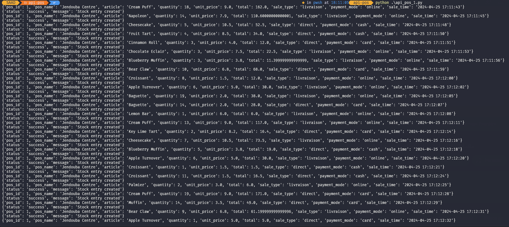
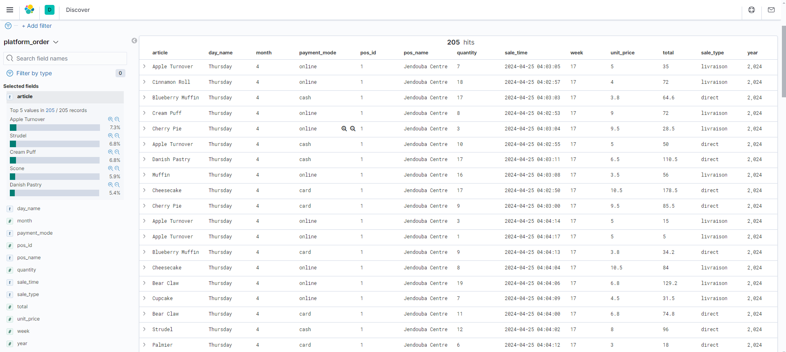
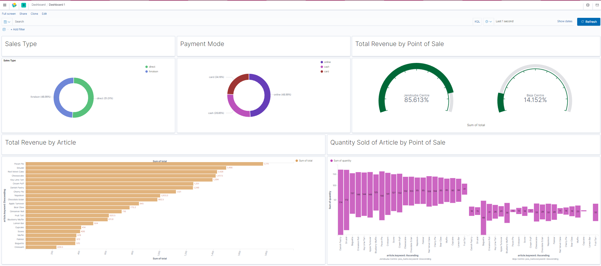

# Real-Time Sales Data Pipeline with Kafka, Flink, Elasticsearch, and Kibana

This repository provides a streamlined solution for building a real-time sales data pipeline. Leveraging Kafka, Flink, Elasticsearch, and Kibana, it offers a comprehensive platform for ingesting, processing, storing, and visualizing sales data in real-time.

## Getting Started:

Follow these steps to set up and run the Real-Time Sales Data Pipeline:

### 1. Clone the Repository:
```bash
git clone https://github.com/saadkh1/Real-Time_Sales_Data_Pipeline_Kafa_Flink_Elasticsearch_Kibana
```

### 2. Navigate to the Project Directory:
```bash
cd Real-Time_Sales_Data_Pipeline_Kafa_Flink_Elasticsearch_Kibana
```

### 3. Run Docker Compose:

* Windows:
```bash
run.bat
```

* Linux:
```bash
run.sh
```

This command initiates Docker Compose to launch all the necessary containers, including Kafka, Flink, Elasticsearch, Kibana, and the FastAPI service. Additionally, it sets up the Kafka topic and runs the Flink job.

### 4. Run Data Generators:

Within the `api-pos` directory, execute the Python scripts (`api_pos_1.py` and `api_pos_2.py`) o simulate sales data using the POST method. These scripts send data to the FastAPI service, which then acts as a Kafka producer, forwarding it to the Kafka topic.

```bash
cd api-pos
python api_pos_1.py & # Run in the background
python api_pos_2.py & # Run in the background (optional for additional data)
```

## Pipeline Overview:

### 1. Data Generation (Optional):
* The `api-pos` scripts (if run) generate synthetic sales data.
 
### 2. Data Ingestion:
* The generated data is sent to the FastAPI service using POST requests.
### 3. Data Processing by FastAPI:
* The FastAPI service, acting as a Kafka producer, reads data from the Python scripts (`api_pos_1.py` and `api_pos_2.py`) and forwards it to the Kafka topic.
### 4. Real-Time Data Stream:
* Kafka acts as a real-time message broker, streaming the sales data to the Flink application.
### 5. Data Processing by Flink:
* A Flink job, functioning as a Kafka consumer, continuously reads data from the Kafka topic, processing it and performing necessary transformations.
### 6. Data Storage in Elasitcsearch:
* The processed data is saved to the Elasitcsearch.
### 7. Data Visualization with Kibana:
* Kibana dashboards can be created to visualize the real-time sales data stored in Elasticsearch.

 
